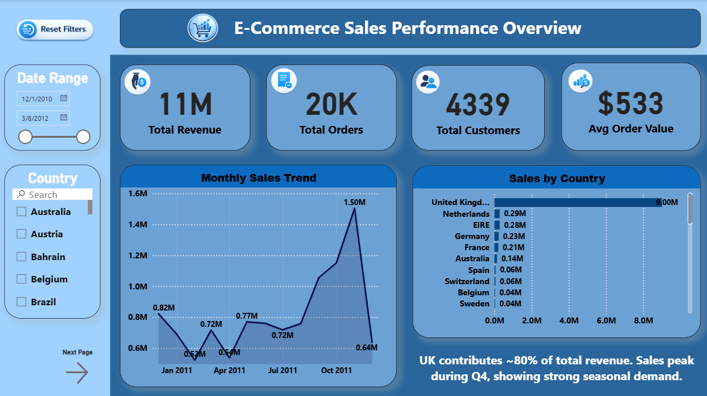
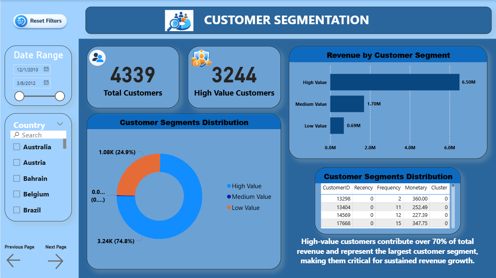
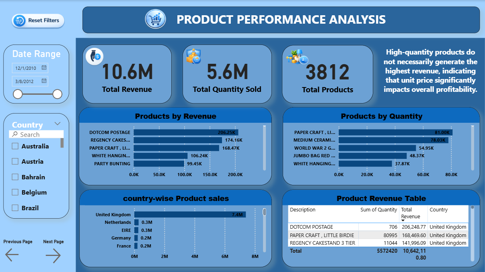
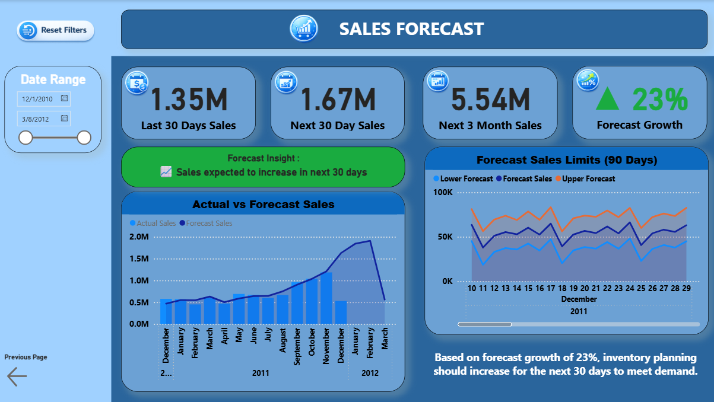

# 📊 E-Commerce Sales Analytics with ML & Power BI

An end-to-end Data Science project combining **Machine Learning** and **Power BI Dashboarding** using real-world E-commerce transaction data.

---

## 📁 Project Structure

```
E-Commerce Sales Analytics/
│
├── data/
│   ├── clean_sales.csv
│   ├── customer_clusters.csv
│   ├── sales_forecast.csv
│   ├── data.csv
│   └── sales.csv
│
├── ML/
│   ├── data_cleaning.ipynb
│   ├── customer_segmentation.ipynb
│   └── sales_forecasting.ipynb
│
├── Powerbi/
│   └── Ecommerce_dashboard.pbix
│
└── README.md
```

---

## 🚀 Project Objective

This project analyzes e-commerce sales data to:

* Understand sales performance
* Identify high-value customers
* Analyze product performance
* Forecast future sales
* Build interactive business dashboards

---

## 🛠 Technologies Used

* Python
* Pandas
* Scikit-learn (K-Means Clustering)
* Prophet (Time Series Forecasting)
* Power BI
* DAX
* Git & GitHub

---

## 🧹 Data Cleaning

* Removed cancelled transactions
* Removed negative quantity & price
* Dropped null `CustomerID` for ML modeling
* Created TotalPrice feature
* Aggregated monthly sales for forecasting

---

## 🤖 Machine Learning Models

### 🔹 Customer Segmentation

* RFM (Recency, Frequency, Monetary)
* StandardScaler
* K-Means Clustering
* Cluster labeling (High / Medium / Low Value)

### 🔹 Sales Forecasting

* Monthly aggregation
* Prophet model
* 90-day sales prediction
* Forecast growth calculation

---

## 📊 Power BI Dashboard Pages

### 1️⃣ Sales Performance Overview

* Total Revenue
* Total Orders
* Total Customers
* Average Order Value
* Monthly Sales Trend
* Sales by Country

### 2️⃣ Customer Segmentation

* Cluster distribution
* Revenue by segment
* High-value customer insights

### 3️⃣ Product Performance Analysis

* Top products by revenue
* Top products by quantity
* Country-wise product sales

### 4️⃣ Sales Forecast

* Last 30 Days Sales
* Next 30 Days Forecast
* Next 3 Months Forecast
* Forecast Growth %
* Actual vs Forecast comparison

---

## 📈 Key Insights

* United Kingdom contributes ~80% of total revenue.
* High-value customers generate majority of revenue.
* Strong seasonal demand in Q4.
* Forecast indicates positive growth trend.

---

## 📊 Dashboard Screenshots

### 🔹 Sales Performance Overview


### 🔹 Customer Segmentation


### 🔹 Product Performance Analysis


### 🔹 Sales Forecast


---

## 💼 Resume Summary

Developed an end-to-end E-Commerce Analytics solution integrating Machine Learning and Power BI to generate actionable business insights from 500K+ transaction records.

---

## 👤 Author

**Karkuvel**
Aspiring ML Engineer | Data Scientist

```
